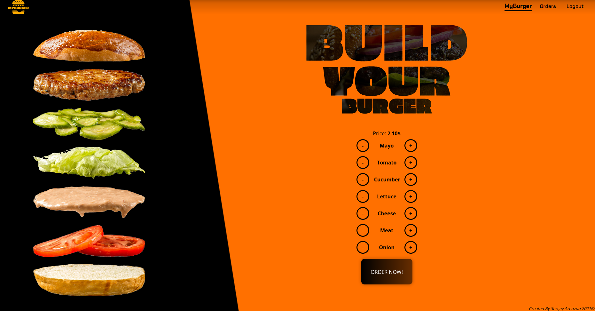

# MyBurger



### Live Demo
https://my-burger-market.herokuapp.com/


### Introduction
A responsive Web app project, shows a burger restaurat that helps consumer to build their own burger with their specific ingredients and manage their orders history.

### Technologies
Project created with:
* NodeJS
* ExpressJS
* MongoDB
* ReactJS
* Redux

### Setup
To run this project, install it locally using npm:
```
$ npm install
$ npm start
```
